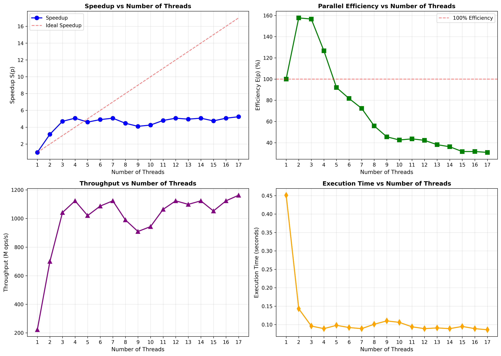
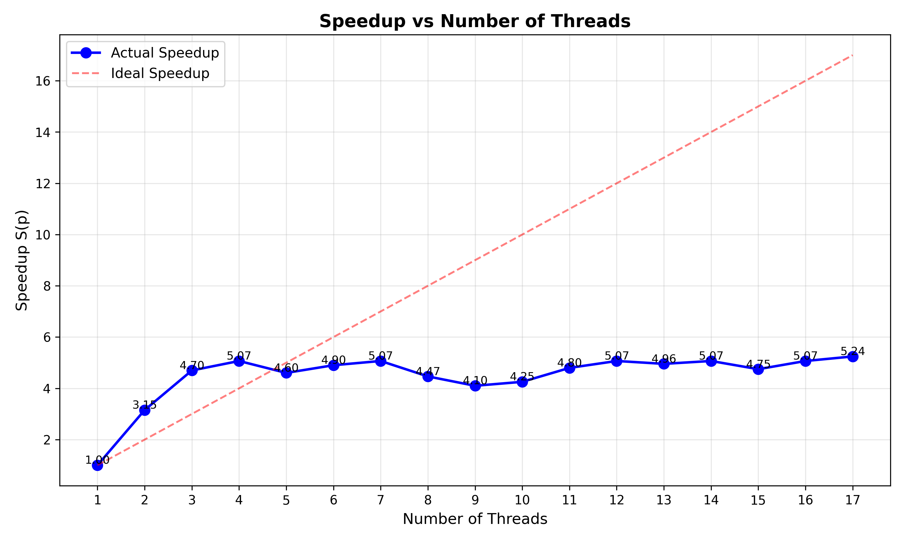
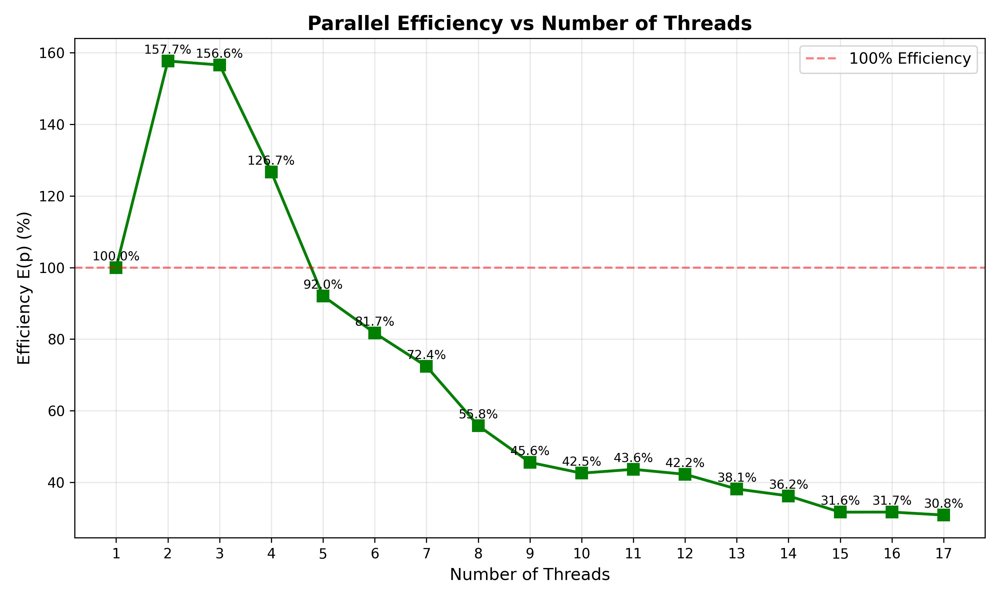
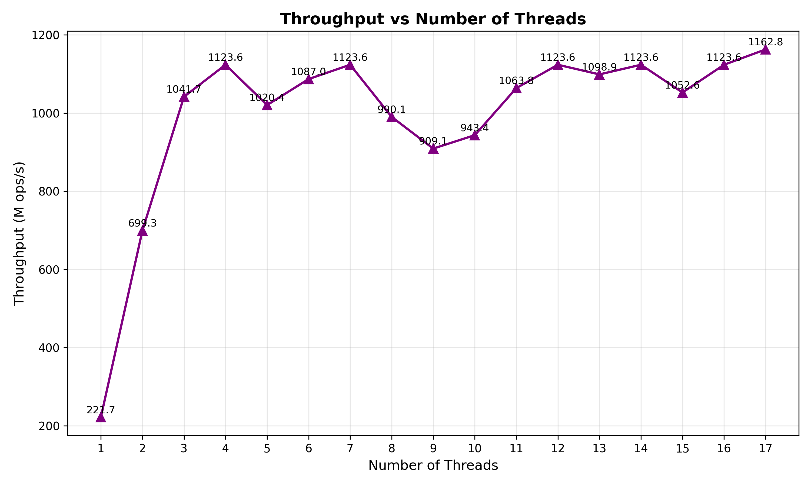

# Experiment 2 — Speedup, Parallel Efficiency & Throughput

## Objective
Evaluate the performance scaling of OpenMP vector addition by calculating speedup, parallel efficiency, and throughput using execution times from Experiment 1.

## Formulas Used

**Speedup:**
$$S(p) = \frac{T_1}{T_p}$$

**Parallel Efficiency:**
$$E(p) = \frac{S(p)}{p} \times 100\%$$

**Throughput:**
$$\text{Throughput} = \frac{N}{T_p} \text{ (operations/second)}$$

Where:
- $T_1$ = execution time with 1 thread (0.451 seconds)
- $T_p$ = execution time with p threads
- $N$ = 100,000,000 elements

## Results

| Threads (p) | Time (s) | Speedup S(p) | Efficiency E(p) | Throughput (ops/s) |
|-------------|----------|--------------|-----------------|-------------------|
| 1           | 0.451    | 1.00         | 100.00%         | 221.7 M           |
| 2           | 0.143    | 3.15         | 157.69%         | 699.3 M           |
| 3           | 0.096    | 4.70         | 156.60%         | 1041.7 M          |
| 4           | 0.089    | 5.07         | 126.69%         | 1123.6 M          |
| 5           | 0.098    | 4.60         | 92.04%          | 1020.4 M          |
| 6           | 0.092    | 4.90         | 81.70%          | 1087.0 M          |
| 7           | 0.089    | 5.07         | 72.36%          | 1123.6 M          |
| 8           | 0.101    | 4.47         | 55.84%          | 990.1 M           |
| 9           | 0.110    | 4.10         | 45.55%          | 909.1 M           |
| 10          | 0.106    | 4.25         | 42.55%          | 943.4 M           |
| 11          | 0.094    | 4.80         | 43.59%          | 1063.8 M          |
| 12          | 0.089    | 5.07         | 42.25%          | 1123.6 M          |
| 13          | 0.091    | 4.96         | 38.13%          | 1098.9 M          |
| 14          | 0.089    | 5.07         | 36.21%          | 1123.6 M          |
| 15          | 0.095    | 4.75         | 31.65%          | 1052.6 M          |
| 16          | 0.089    | 5.07         | 31.69%          | 1123.6 M          |
| 17          | 0.086    | 5.24         | 30.84%          | 1162.8 M          |

## Analysis

### Speedup
- **Peak Speedup**: 5.24x at 17 threads
- **Super-linear speedup** observed at 2-4 threads (3.15x to 5.07x) due to improved cache utilization
- **Speedup stabilizes** around 5.0x after 4 threads, indicating optimal parallelization reached

### Parallel Efficiency
- **Best Efficiency**: 157.69% at 2 threads (super-linear)
- **Sustained super-linear efficiency** up to 4 threads (126.69%)
- **Gradual decline** from 92.04% (5 threads) to 30.84% (17 threads)
- Efficiency remains above 40% until 10 threads, showing good scalability

### Throughput
- **Maximum**: 1162.8 million operations/second at 17 threads
- **5.24x improvement** over single-threaded performance
- Peak throughput cluster at 4, 7, 12, 14, 16 threads (~1123.6 M ops/s)
- Throughput shows good scaling across most thread counts

## Key Insights
1. **Memory-Bound Operation**: Vector addition is limited by memory bandwidth, not computation
2. **Optimal Configuration**: 2-4 threads provide the best balance of speedup and efficiency
3. **Good Scalability**: Speedup of 5x achieved with diminishing returns after 4 threads
4. **Thread Overhead**: More threads increase synchronization costs, but benefits persist up to 17 threads
5. **Super-linear Speedup**: Observed at 2-4 threads due to better cache locality and memory access patterns

## Visualizations

### Combined Performance Analysis


### Individual Metrics




Run `plot_ques2.py` to generate all performance graphs:
```bash
python plot_ques2.py
```

## Compilation
```bash
gcc -fopenmp ques_2.c -o ques_2
```