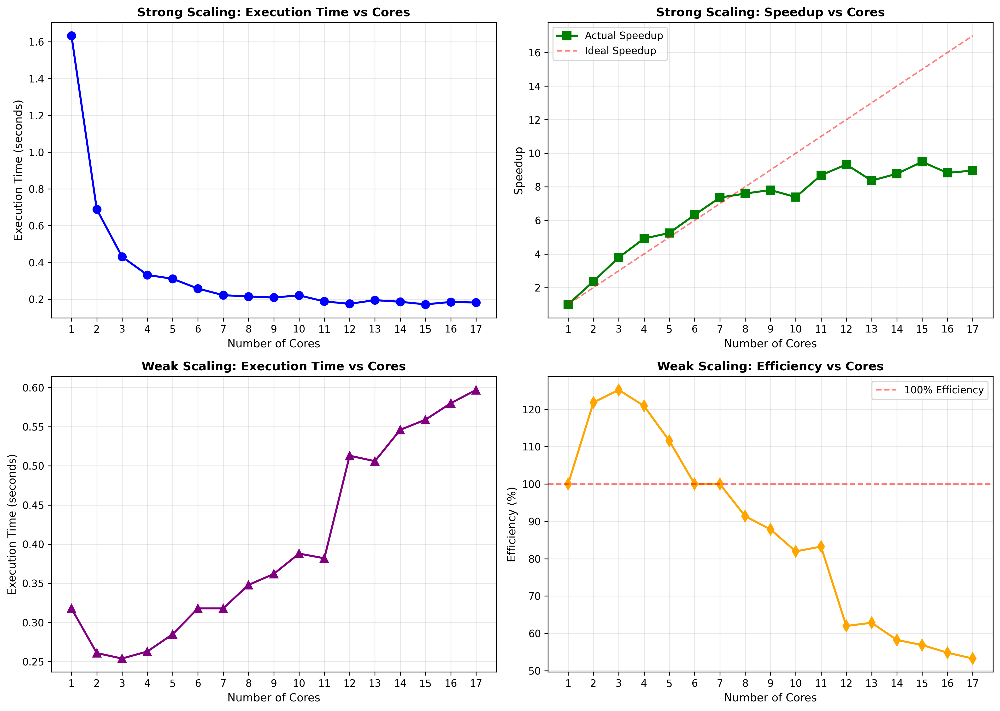
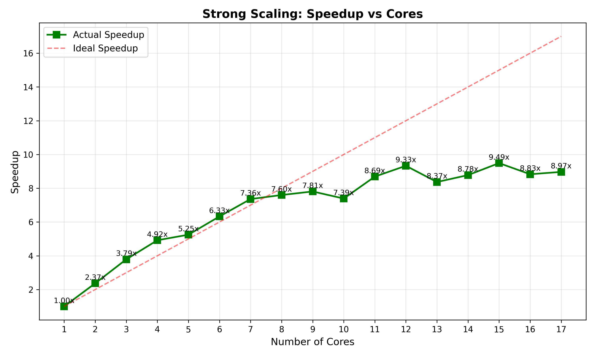
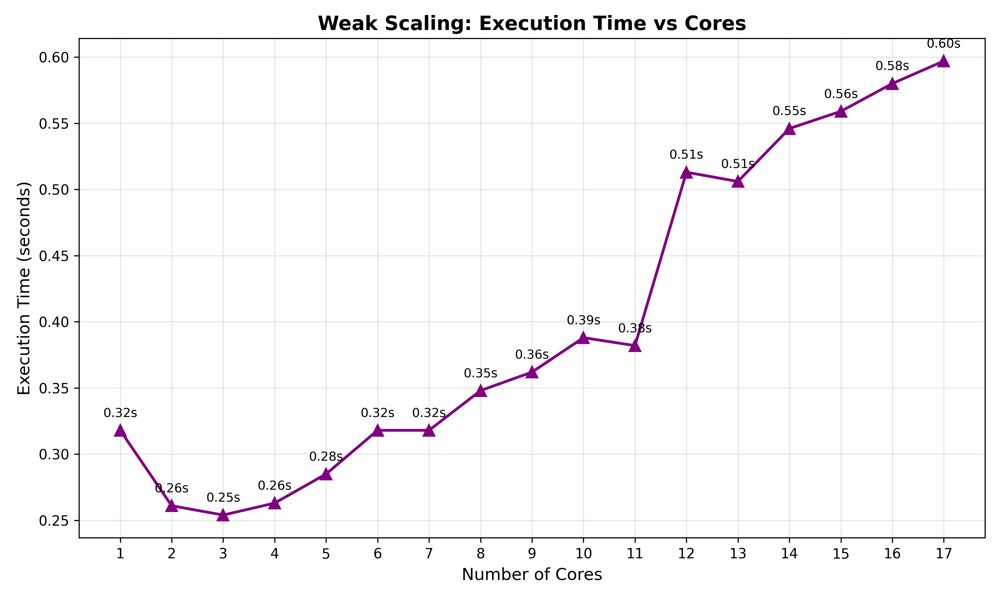
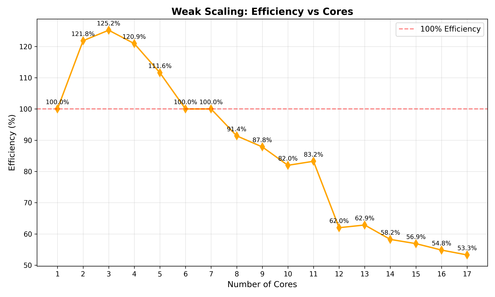

# Experiment 3: Strong Scaling and Weak Scaling

## Objective
Analyze the scalability of parallel programs using OpenMP by evaluating strong scaling and weak scaling performance metrics.

## Concepts

### Strong Scaling
- **Fixed total workload** distributed across increasing number of cores
- Measures how execution time decreases as cores increase
- **Speedup**: S(p) = T₁ / Tₚ
- Ideal: Linear speedup (2x cores → 2x faster)

### Weak Scaling
- **Workload per core remains constant** as cores increase
- Measures ability to handle larger problems with more resources
- **Efficiency**: E(p) = (T₁ / Tₚ) × 100%
- Ideal: Constant execution time (100% efficiency)

## Implementation
- **Problem**: Calculate π using numerical integration
- **Method**: Riemann sum approximation
- **Strong Scaling**: Fixed 500M iterations
- **Weak Scaling**: 100M iterations per core
- **Cores Tested**: 1, 2, 3, 4, 5, 6, 7, 8, 9, 10, 11, 12, 13, 14, 15, 16, 17

## Results

### Strong Scaling
| Cores | Time (s) | Speedup |
|-------|----------|---------|
| 1     | 1.6330   | 1.00x   |
| 2     | 0.6890   | 2.37x   |
| 3     | 0.4310   | 3.79x   |
| 4     | 0.3320   | 4.92x   |
| 5     | 0.3110   | 5.25x   |
| 6     | 0.2580   | 6.33x   |
| 7     | 0.2220   | 7.36x   |
| 8     | 0.2150   | 7.60x   |
| 9     | 0.2090   | 7.81x   |
| 10    | 0.2210   | 7.39x   |
| 11    | 0.1880   | 8.69x   |
| 12    | 0.1750   | 9.33x   |
| 13    | 0.1950   | 8.37x   |
| 14    | 0.1860   | 8.78x   |
| 15    | 0.1720   | 9.49x   |
| 16    | 0.1850   | 8.83x   |
| 17    | 0.1820   | 8.97x   |

### Weak Scaling
| Cores | Work         | Time (s) | Efficiency |
|-------|--------------|----------|------------|
| 1     | 100M         | 0.3180   | 100.00%    |
| 2     | 200M         | 0.2610   | 121.84%    |
| 3     | 300M         | 0.2540   | 125.20%    |
| 4     | 400M         | 0.2630   | 120.91%    |
| 5     | 500M         | 0.2850   | 111.58%    |
| 6     | 600M         | 0.3180   | 100.00%    |
| 7     | 700M         | 0.3180   | 100.00%    |
| 8     | 800M         | 0.3480   | 91.38%     |
| 9     | 900M         | 0.3620   | 87.85%     |
| 10    | 1000M        | 0.3880   | 81.96%     |
| 11    | 1100M        | 0.3820   | 83.25%     |
| 12    | 1200M        | 0.5130   | 61.99%     |
| 13    | 1300M        | 0.5060   | 62.85%     |
| 14    | 1400M        | 0.5460   | 58.24%     |
| 15    | 1500M        | 0.5590   | 56.89%     |
| 16    | 1600M        | 0.5800   | 54.83%     |
| 17    | 1700M        | 0.5970   | 53.27%     |

## Analysis

### Strong Scaling Performance
- **Peak speedup**: 9.49x at 15 cores (from 1.633s to 0.172s)
- **Good scalability** observed up to 12 cores (9.33x speedup)
- Near-linear speedup achieved through 8 cores (7.60x)
- Speedup plateaus around 8-9x for 11-17 cores due to overhead
- Some performance variability observed at higher core counts

### Weak Scaling Performance
- **Super-linear efficiency** observed at 2-5 cores (peak 125.20% at 3 cores)
- Efficiency remains at or above 100% through 7 cores
- **Gradual decline** begins after 8 cores (91.38%)
- **Significant drop** occurs at 12 cores (61.99%) - possible system limit
- Efficiency stabilizes around 53-63% for 12-17 cores
- Super-linear efficiency likely due to improved cache utilization at low core counts

## Visualizations

### Combined Scaling Analysis


### Strong Scaling Metrics



### Weak Scaling Metrics



Generate plots with:
```bash
python plot_ques3.py
```

## Key Insights
1. **Strong Scaling**: Excellent speedup (9.49x with 15 cores) demonstrates effective parallelization for fixed workload
2. **Weak Scaling**: Super-linear efficiency (up to 125%) at low core counts shows cache benefits
3. **Overhead Impact**: Both metrics show overhead increases significantly beyond 11 cores
4. **Sweet Spot**: 6-8 cores provide optimal balance of performance (>7x speedup) and efficiency (>91%)
5. **System Limit**: Noticeable performance degradation at 12+ cores suggests hardware constraints (memory bandwidth, cache coherence)

## Compilation
```bash
gcc -fopenmp ques_3.c -o ques_3
```