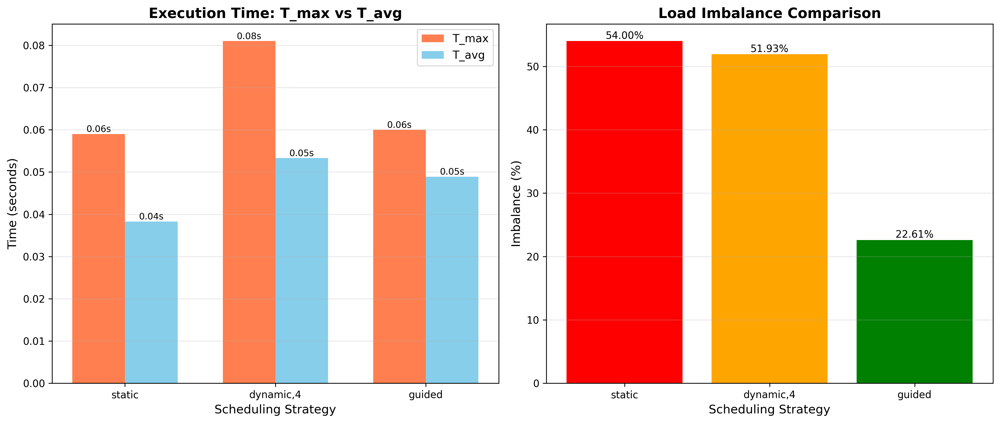
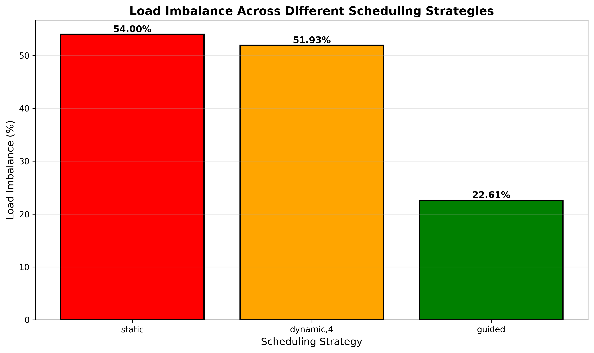
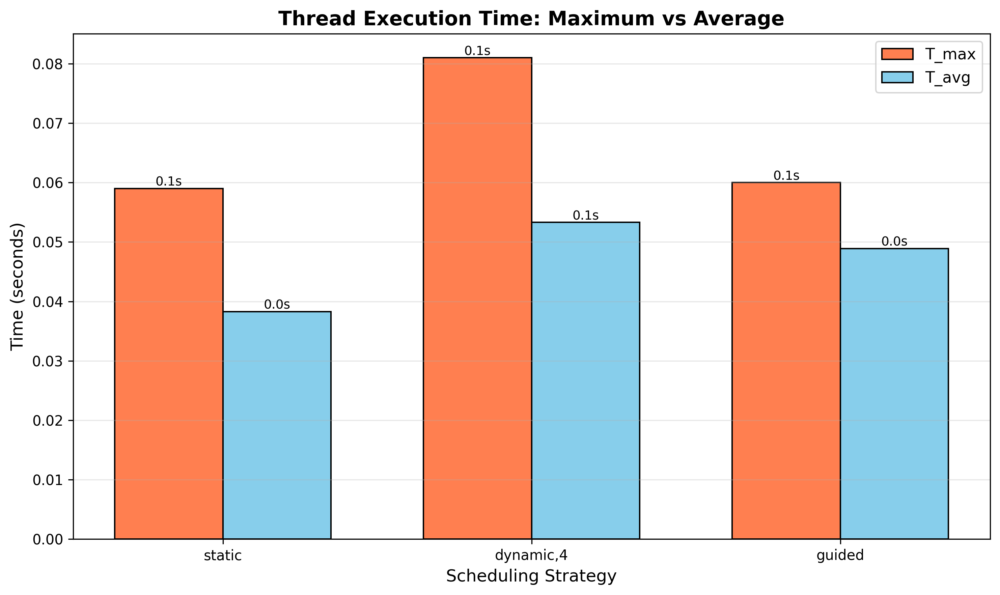

# Experiment 4: Scheduling and Load Imbalance in OpenMP

## Objective
Analyze and compare different OpenMP loop scheduling strategies to understand their impact on load balancing and performance in parallel computing.

## Scheduling Strategies

### 1. Static Scheduling
- **Behavior**: Divides iterations into equal-sized chunks assigned to threads at compile time
- **Use Case**: Best for uniform workloads where each iteration takes similar time
- **Pros**: Low overhead, predictable
- **Cons**: Poor performance with imbalanced workloads

### 2. Dynamic Scheduling (chunk=4)
- **Behavior**: Assigns small chunks (size 4) to threads at runtime as they become available
- **Use Case**: Good for moderately imbalanced workloads
- **Pros**: Better load balancing than static
- **Cons**: Higher overhead due to runtime scheduling

### 3. Guided Scheduling
- **Behavior**: Starts with large chunks and progressively reduces chunk size
- **Use Case**: Optimal for highly imbalanced workloads
- **Pros**: Balances performance and overhead
- **Cons**: Slightly more complex scheduling logic

## Implementation
- **Workload**: Progressive computation - iteration i requires (i+1)×200,000 operations
- **Total Iterations**: 2,000
- **Operation**: sin(j) × cos(j) calculations
- **Measurement**: Per-thread execution time

## Results

| Schedule   | T_max (s) | T_avg (s) | Imbalance (%) |
|------------|-----------|-----------|---------------|
| static     | 0.0590    | 0.0383    | 54.00%        |
| dynamic,4  | 0.0810    | 0.0533    | 51.93%        |
| guided     | 0.0600    | 0.0489    | 22.61%        |

## Analysis

### Load Imbalance Formula
$$\text{Imbalance} = \frac{T_{max} - T_{avg}}{T_{avg}} \times 100\%$$

Where:
- $T_{max}$ = Maximum time taken by any thread
- $T_{avg}$ = Average time across all threads

### Performance Observations

**Static Scheduling:**
- High imbalance (54.00%)
- T_max (0.059s) is **1.54x** T_avg (0.038s)
- Early threads finish quickly while late threads are overloaded
- Fixed chunk assignment causes uneven work distribution
- Total execution time dominated by the slowest thread

**Dynamic Scheduling:**
- Similar imbalance to static: 51.93%
- Runtime overhead affects performance (0.081s)
- Small chunk size (4) increases scheduling overhead
- **Slowest** of all three strategies in this configuration
- Overhead from dynamic scheduling outweighs load balancing benefits

**Guided Scheduling:**
- Best performance: only 22.61% imbalance
- Much better load balance than static and dynamic
- **Fastest execution** (0.060s vs 0.059s static, 0.081s dynamic)
- Adaptive chunking provides optimal balance of low overhead and good distribution
- Large initial chunks reduce overhead, smaller final chunks improve balance

## Key Insights

1. **Workload Matters**: Static has low overhead but suffers from 54% imbalance
2. **Dynamic Overhead**: Small chunk size (4) can introduce significant scheduling overhead
3. **Guided Wins**: Best balance of performance and load distribution (22.61% imbalance)
4. **Overhead Trade-off**: Dynamic's overhead (0.081s) exceeded static's imbalance penalty (0.059s)
5. **Adaptive Strategy**: Guided's adaptive chunking provides optimal performance for progressive workloads

## Visualizations

### Scheduling Comparison


### Load Imbalance


### Thread Distribution


Generate plots with:
```bash
python plot_q4.py
```

Or generate simple visualization map:
```bash
python q4_map.py
```

## Compilation
```bash
gcc -fopenmp q4.c -o q4 -lm
```

## Execution
```bash
q4
```

## Conclusion
For workloads with variable iteration costs, **guided scheduling** provides the best load balancing with acceptable overhead. Static scheduling should only be used when all iterations have similar execution times.
