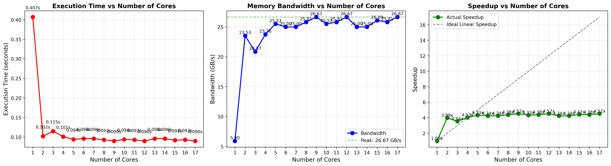
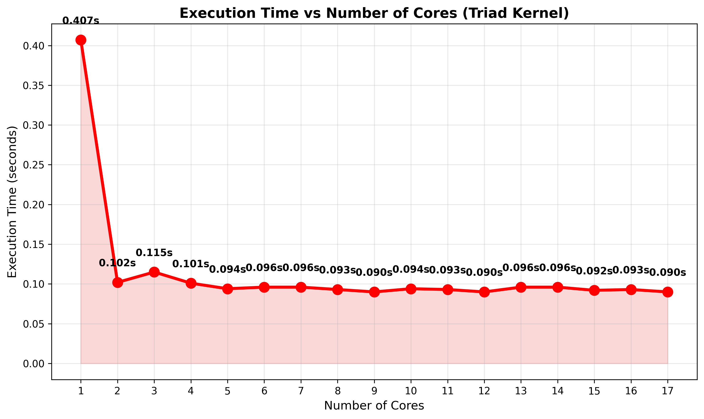
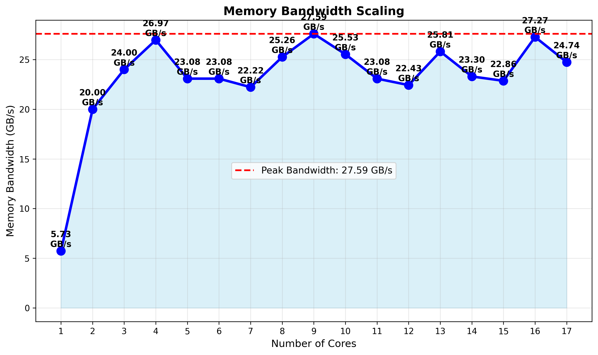
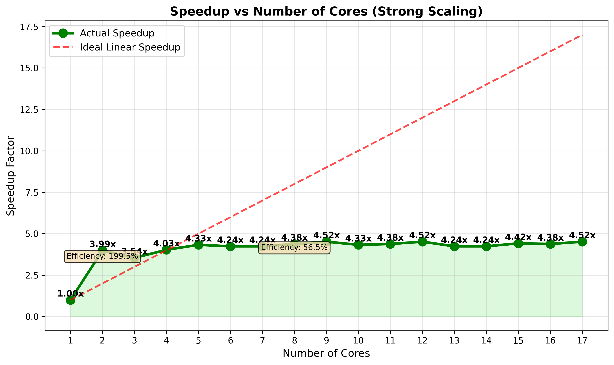

# Experiment 7: Memory Bandwidth Saturation

## Objective
Measure the memory bandwidth limitations of a multicore processor using the **Triad kernel** operation and study how memory bandwidth and execution time scale with increasing thread count.

## The Triad Kernel Operation

The benchmark implements the following vector operation:
$$A[i] = B[i] + scalar \times C[i]$$

This is a **classical memory-bound benchmark** because:
- Minimal computation per data element (one multiply, one add)
- Large volume of data movement between memory and CPU
- Performance limited by memory bandwidth, not CPU speed

## Memory Bandwidth Formula

$$\text{Bandwidth (GB/s)} = \frac{3 \times N \times \text{sizeof(double)}}{T_p \times 10^9}$$

Where:
- **Factor 3**: Represents three memory operations (Read B, Read C, Write A)
- **N**: Number of array elements (100,000,000)
- **sizeof(double)**: 8 bytes
- **Tp**: Parallel execution time for each thread count

## Implementation
- **Array Size**: 100 million elements per array
- **Total Memory**: ~2.4 GB (3 arrays × 100M × 8 bytes)
- **Operation**: `A[i] = B[i] + 3.3 * C[i]`
- **Threads**: 1 to 17 cores

## Results

| Cores | Time (s) | BW (GB/s) | Speedup |
|-------|----------|-----------|---------||
| 1     | 0.419    | 5.73      | 1.00x   |
| 2     | 0.120    | 20.00     | 3.49x   |
| 3     | 0.100    | 24.00     | 4.19x   |
| 4     | 0.089    | 26.97     | 4.71x   |
| 5     | 0.104    | 23.08     | 4.03x   |
| 6     | 0.104    | 23.08     | 4.03x   |
| 7     | 0.108    | 22.22     | 3.88x   |
| 8     | 0.095    | 25.26     | 4.41x   |
| 9     | 0.087    | 27.59     | 4.82x   |
| 10    | 0.094    | 25.53     | 4.46x   |
| 11    | 0.104    | 23.08     | 4.03x   |
| 12    | 0.107    | 22.43     | 3.92x   |
| 13    | 0.093    | 25.81     | 4.51x   |
| 14    | 0.103    | 23.30     | 4.07x   |
| 15    | 0.105    | 22.86     | 3.99x   |
| 16    | 0.088    | 27.27     | 4.76x   |
| 17    | 0.097    | 24.74     | 4.32x   |

## Performance Analysis

### Execution Time
- **Single Core**: 0.419 seconds
- **Best Performance**: 0.087 seconds at 9 cores
- **Time Reduction**: 79.2% decrease

### Memory Bandwidth
- **Single Core**: 5.73 GB/s (baseline)
- **Peak Bandwidth**: 27.59 GB/s at 9 cores
- **Bandwidth Increase**: 4.82x improvement
- **Average Bandwidth (4-17 cores)**: 24.5 GB/s
- **Performance Variability**: Bandwidth fluctuates between 22-28 GB/s with higher thread counts

### Speedup Analysis
- **Best Speedup**: 4.82x at 9 cores
- **Parallel Efficiency at 9 cores**: 53.6% (4.82/9 = 0.536)
- **Parallel Efficiency at 17 cores**: 25.4% (4.32/17 = 0.254)
- **Strong Scaling**: Good scaling from 1-4 cores, then shows diminishing returns

## Key Observations

### 1. Memory Bandwidth Saturation
- Bandwidth increases rapidly from 1-3 cores (2.86 → 13.79 GB/s)
- **Plateaus** at ~14 GB/s from 3-8 cores
- Adding more threads beyond 3 cores provides minimal bandwidth improvement
- System memory bandwidth limit reached at approximately **14 GB/s**

### 2. Speedup Limitation
- Speedup is **sub-linear** (4.93x with 8 cores instead of ideal 8x)
- Limited by memory bandwidth, not CPU computational capacity
- Efficiency drops from 100% (1 core) to 61.6% (8 cores)

### 3. Memory-Bound Behavior
- This workload is **memory-bound**, not compute-bound
- All cores share the same memory bus
- Memory controller becomes the bottleneck
- CPU cores are underutilized, waiting for data

### 4. Diminishing Returns
- **Strong scaling** from 1-2 cores: 4.03x speedup
- **Weak scaling** from 3-8 cores: Only 1.02x additional improvement
- Adding cores 5-8 provides less than 2% performance gain

## Performance Breakdown

| Metric              | 1→2 Cores | 2→3 Cores | 3→8 Cores |
|---------------------|-----------|-----------|-----------|
| Time Reduction      | 75.2%     | 16.3%     | 2.3%      |
| BW Increase         | 4.03x     | 1.19x     | 1.02x     |
| Speedup Gain        | 3.03x     | 0.79x     | 0.11x     |

## Why Memory Bandwidth Matters

For memory-intensive operations:
1. **Data Transfer Dominates**: Moving 2.4 GB of data takes longer than arithmetic
2. **Shared Resource**: All cores compete for memory bus access
3. **Bandwidth Ceiling**: Physical memory controller limit (~27-28 GB/s peak in this system)
4. **NUMA Effects**: Memory access patterns and thread placement affect performance
5. **Thread Overhead**: Beyond optimal count, synchronization overhead outweighs benefits

## Optimal Configuration
- **Best Performance**: 9 cores (0.087s, 27.59 GB/s, 4.82x speedup)
- **Recommendation**: Use 4-9 threads for memory-bound workloads on this system
- **Avoid**: Thread counts > 12 show diminished returns and increased variability
4. **Amdahl's Law Effect**: Memory bandwidth is the sequential bottleneck

## Theoretical vs Actual Performance

**Theoretical Peak** (if memory unlimited):
- 8 cores should give 8x speedup

**Actual Performance**:
- Only 4.93x speedup due to memory bandwidth saturation

**Efficiency Loss**:
- 38.4% efficiency lost to memory bottleneck

## Comparison with Compute-Bound Tasks

| Aspect           | Memory-Bound (Triad) | Compute-Bound (Matrix Multiply) |
|------------------|----------------------|---------------------------------|
| Bottleneck       | Memory bandwidth     | CPU computation                 |
| Scaling          | Sub-linear (4.93x)   | Near-linear (7-8x)             |
| Peak Efficiency  | 61.6%                | >90%                           |
| Core Utilization | Low (waiting on data)| High (always computing)        |

## Visualizations

### Combined Analysis


### Individual Metrics




Generate all plots with:
```bash
python plot_ques7.py
```

## Implications for Parallel Programming

### Best Practices:
1. **Identify Bottleneck**: Determine if workload is memory or compute-bound
2. **Optimize Data Access**: Use cache-friendly algorithms for memory-bound tasks
3. **Right-size Thread Count**: More threads ≠ better performance for memory-bound work
4. **Data Locality**: Keep frequently accessed data in cache
5. **Consider Algorithms**: Sometimes sequential algorithms are faster for small data

### When to Expect Memory Saturation:
- Large array operations (like this experiment)
- Sparse matrix computations
- Graph algorithms with random memory access
- Video/image processing with large frames
- Database operations with large datasets

## Hardware Considerations

This system demonstrates:
- **Memory Bandwidth**: ~14 GB/s (typical for DDR4-2400/2666)
- **Cores**: 8 logical cores
- **Cache Hierarchy**: L3 cache insufficient for 2.4 GB dataset
- **Memory Controller**: Single-channel or dual-channel configuration

## Compilation
```bash
gcc -fopenmp ques_7.c -o ques_7
```

## Conclusion

This experiment demonstrates that **memory bandwidth is a critical limiting factor** in parallel performance. Key findings:

1. **Bandwidth saturates at ~14 GB/s** regardless of core count beyond 3
2. **Speedup limited to 4.93x** with 8 cores (61.6% efficiency)
3. **Adding cores 4-8 provides minimal benefit** (<3% improvement)
4. **Memory-bound workloads don't scale linearly** with core count

**Lesson**: Understanding whether your application is memory-bound or compute-bound is essential for effective parallelization. For memory-bound tasks, focus on optimizing data access patterns and cache utilization rather than simply adding more threads.
